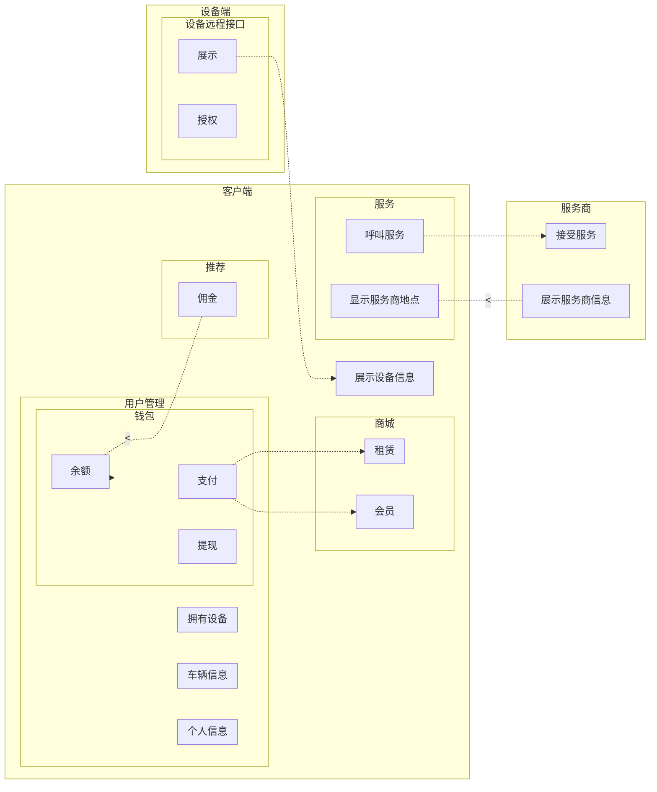

```mermaid

flowchart LR;
    呼叫服务-.->接受服务
    显示服务商地点-."<"-.-展示服务商信息
    余额-."<"-.-佣金

    展示-.->展示设备信息
    余额-.->钱包
    支付-.->租赁
    支付-.->会员

    subgraph 客户端

        subgraph "用户管理"       
         direction RL
            subgraph "个人信息"
            end
            subgraph "车辆信息"
            end
            subgraph "拥有设备"
            end
            subgraph 钱包
                余额
                支付
                提现
            end
        end
        展示设备信息
        subgraph 推荐
            佣金
        end
        subgraph "商城"
            subgraph "租赁"
            end
            会员
        end
        subgraph 服务
            显示服务商地点
            呼叫服务
        end
    end
    subgraph 设备端
        subgraph 设备远程接口
            展示
            授权
        end
    end


    subgraph "服务商"
        subgraph "接受服务"
        end
        展示服务商信息
    end


```
<!-- subgraph 二期需求
subgraph 服务商管理
end
subgraph "设备购买"
end
end -->